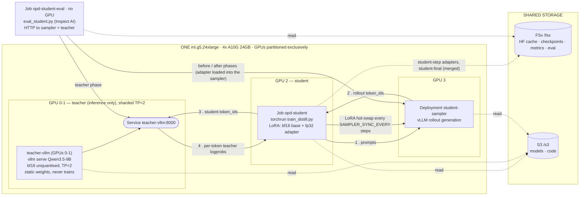

# On-Policy Distillation — Architecture

Everything runs on **one** `ml.g5.24xlarge` (4× A10G 24 GB). K8s allocates GPUs to a pod
**exclusively** — there is no MPS or time-slicing on this cluster — so the four devices are
*partitioned*, never shared. Oversubscribing them raises no error anywhere; the losing pod
simply sits `Pending`, which is why `preflight.py` check [8] does the subtraction
(`TEACHER_TP × TEACHER_REPLICAS + GPU_PER_NODE + SAMPLER_GPUS ≤ NODE_GPUS`) before anything
launches. Note the **product**: each teacher replica claims `TEACHER_TP` GPUs of its own, so at
`TEACHER_TP=2` the teacher already takes two devices.

| GPU | Occupant | Footprint |
|---|---|---|
| 0 | `teacher-vllm` rank 0 — half of one bf16 `Qwen/Qwen3.5-9B`, TP=2, `replicas: 1` | ~9.0 GB weights + ~7.8 GB cache |
| 1 | `teacher-vllm` rank 1 — the other half | ~9.0 GB weights + ~7.8 GB cache |
| 2 | the student — stage 1 trainer, then stage 2 eval (sequentially) | ~13 GB (LoRA) |
| 3 | `student-sampler` — vLLM rollouts with LoRA hot-swap | ~8 GB + KV |

**One whole teacher sharded across TP=2, unquantised.** Teacher scoring is a single prefill
forward pass per request (echo-logprobs, zero generated tokens), so its per-request cost is fixed
by the model size, not by tensor parallelism — sharding does not buy throughput but it *is* what
lets a bf16 9B run on one A10G at all, since 18.0 GiB does not fit against a ~20.2 GiB per-GPU
budget. TP=2 revives a PCIe all-reduce (A10G has no NVLink), and on g5.24xlarge GPUs 0-1 and 2-3
sit under separate PCIe switches, so *which* pair the kubelet assigned matters: `preflight` check
[4] warns on `SYS` pairings.

**As configured the node is exactly full (2 + 1 + 1 = 4 of 4).** One scheduling consequence: the
eval Job cannot co-schedule with the trainer — it waits for `opd-student` to `Complete` and free
GPU 2. Deleting the `student-sampler` Deployment is the way to free a GPU without touching the
teacher. Raising `TEACHER_MAX_NUM_SEQS` does nothing here: the teacher is prefill
**compute**-bound at this batch size, not queue-bound.

**Why bf16 rather than a 4-bit teacher at TP=1.** The teacher's per-token log-probs *are* the
supervision signal, so quantisation error lands directly in the KL target. W4A16 of a 9B perturbs
that signal more than the 27B's MLP-only W4A16 did, because there are fewer parameters to absorb
the error, and every 4-bit 9B checkpoint on the Hub is a third-party build. bf16 at TP=2 gives
exact log-probs, at the cost of a second GPU and an all-reduce. And the alternatives on this
hardware are closed:

- In-flight 4-bit is gone. This pipeline used to serve a bf16 repo and let vLLM quantise it to NF4
  during the load (`--quantization bitsandbytes`); vLLM has deleted bitsandbytes from its
  quantization registry, and going back to a build that has it means going back before
  `Qwen3_5ForConditionalGeneration` existed — no image has both.
- FP8/W8A8 is *refused*, not downgraded. A10G is sm_86 and `CompressedTensorsW8A8Fp8` declares
  `get_min_capability() == 89`, so an FP8 9B fails at load with `Min capability: 89. Current
  capability: 86.` W4A16 (`CompressedTensorsWNA16`) is 75, the only quantised route this hardware
  accepts — kept as the fallback in `env_vars` if you need the spare GPU back.

The teacher is also the accuracy **ceiling**: run `EVAL_PHASE=before,teacher` before committing
to the ~9 h run (GSM8K: 0.8B 52.0% vs. 9B 94.5%).

**Cache arithmetic is hybrid-aware.** Qwen3.5 alternates 3 `linear_attention` layers to 1
`full_attention`, so of 32 layers only 8 hold a growing KV cache (32 KiB/token) while 24 hold a
fixed fp32 recurrent state **per sequence** (48 MB). At TP=2 both terms are sharded, so each rank's
~7.8 GB of cache holds ~253k tokens of KV or ~141 concurrent sequences at the full `max_model_len`;
`TEACHER_MAX_NUM_SEQS=48` is **per replica** and well inside that. Memory has stopped being the
binding constraint — prefill compute is.

**Per-step loop:** ① sample a rollout from π_student (in-process, or from the GPU-3 sampler) →
② the teacher scores every sampled token via vLLM echo-logprobs (`log π_teacher`) →
③ `reverse_kl = log π_student − log π_teacher`, clamped to ±`RKL_CLIP`, negated and whitened into
a per-token advantage → ④ clipped importance-sampled policy loss, backprop, update the adapter.
The teacher never trains, so its weights stay static for the whole run.

**Why the sampler is a separate pod.** Most of the wall clock goes to generation, not gradients,
and HF `generate` is roughly 5–10× slower than vLLM here. GPU 3 is the device left after the
teacher (2) and the trainer (1) — the node is exactly full. The trainer pushes its LoRA adapter
into that server every `SAMPLER_SYNC_EVERY` steps (`POST /v1/load_lora_adapter`), so the rollouts
lag the live policy by at most that many steps — the PPO ratio corrects the remainder and
`clip_frac` makes excess lag visible.

**The one scheduling consequence.** As configured the node is 4 of 4 claimed (2 + 1 + 1), so the
eval Job cannot co-schedule with the trainer — it waits for the trainer pod to reach `Completed`
and release GPU 2. Deleting the `student-sampler` Deployment is the way to free a GPU without
touching the teacher; the `teacher` phase of the eval needs `teacher-vllm` up either way, so the
teacher is the *last* thing to delete.
