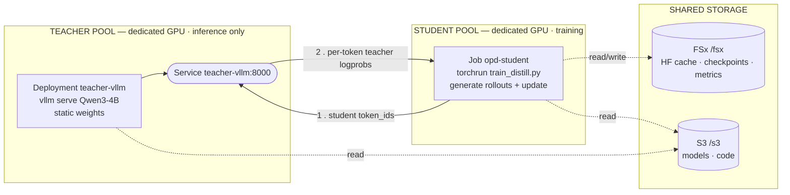

# On-Policy Distillation — Architecture

Two GPU pools, decoupled. The **teacher** is a long-lived vLLM inference `Service`
(static weights, scoring only); the **student** is a separate training `Job`. Each pod
gets a **dedicated GPU** (`nvidia.com/gpu: 1`) — they never share a GPU. Their only
coupling is the cluster network (the `Service` call) and the shared FSx/S3 mounts, so
each pool scales independently.

**Per-step loop:** ① student samples a rollout from π_student → ② teacher scores every
token (log π_teacher) → advantage = −(log π_student − log π_teacher) → student backprops
and updates θ. Repeat. The teacher never trains; scale each pool independently
(more `teacher-vllm` replicas for scoring throughput, more GPUs / FSDP for the student).
